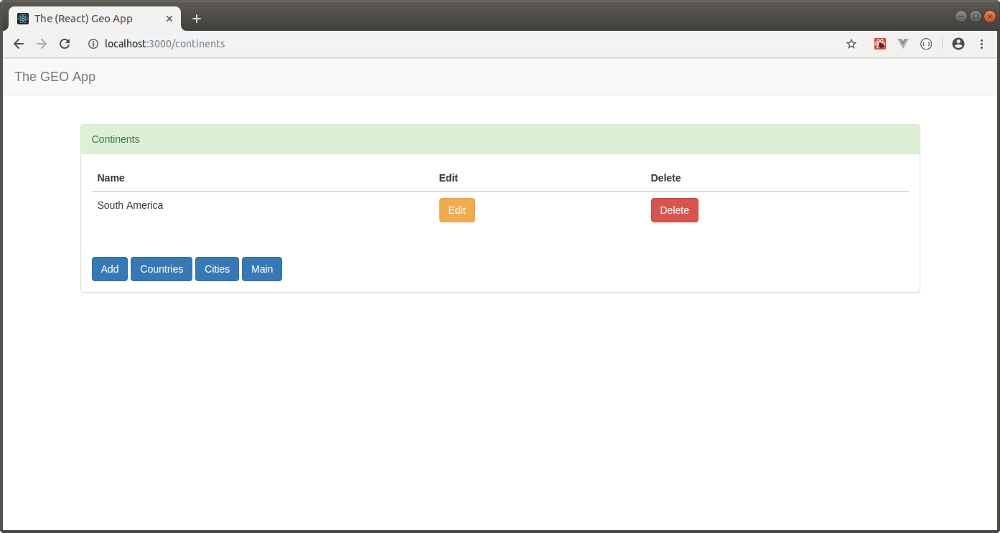
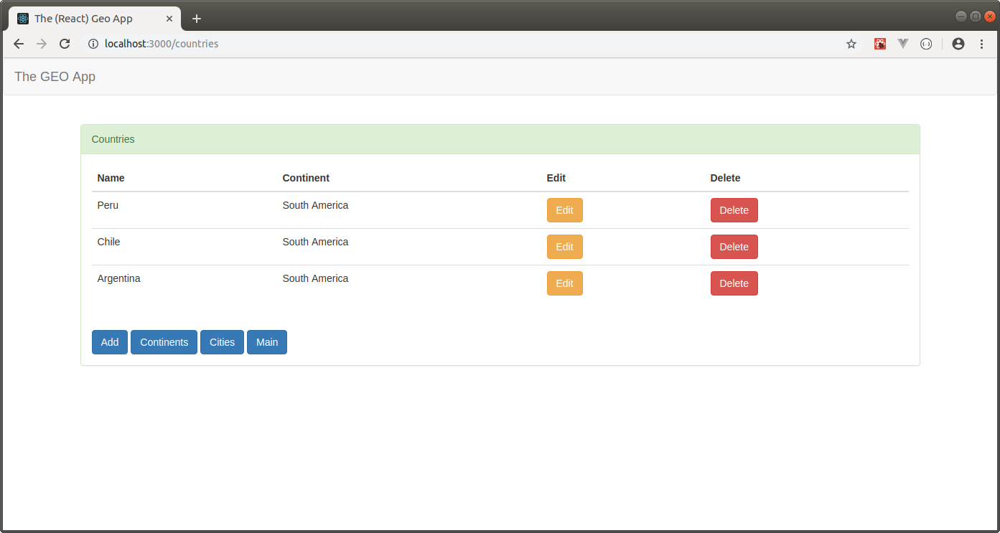
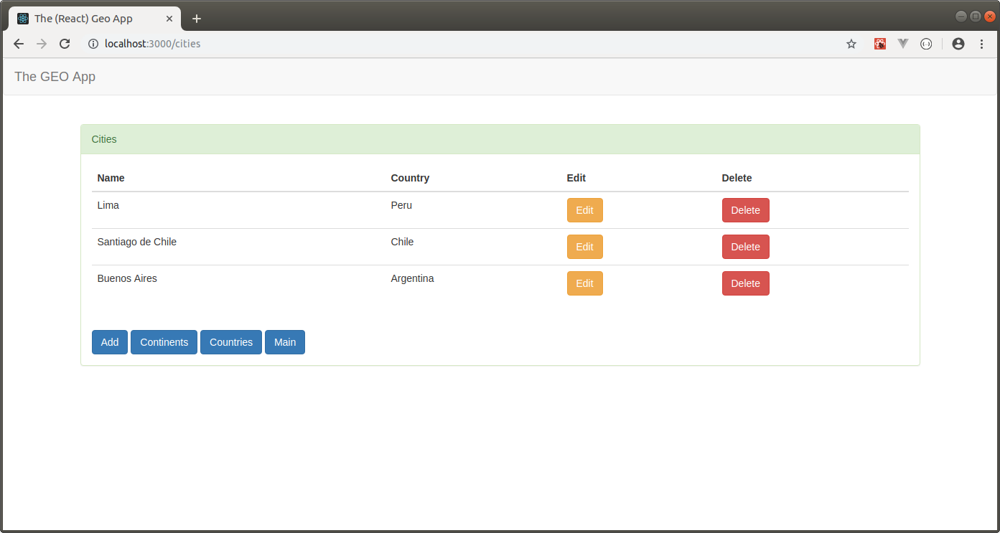

THE (REACT) GEO APP CLIENT
--------------------------------------------------------------------------------------------------------------

App developed with React 16 that retrieves info about continents, countries and cities.

This app uses Axios to fire a Rest API built with Spring Boot:

**THE GEO REST API (SPRING BOOT)**

https://github.com/edgar-code-repository/spring-boot-rest-geo-api

--------------------------------------------------------------------------------------------------------------

Main screen:

--------------------------------------------------------------------------------------------------------------

Continents screen:

--------------------------------------------------------------------------------------------------------------

Countries screen:

--------------------------------------------------------------------------------------------------------------

Cities screen:

--------------------------------------------------------------------------------------------------------------

