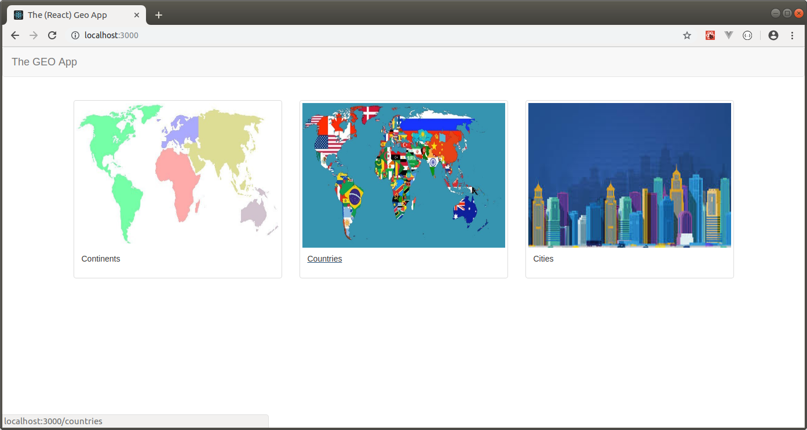

THE (REACT) GEO APP CLIENT
--------------------------------------------------------------------------------------------------------------------

Aplicación SPA desarrollada con React 16 que almacena información de continentes, países y ciudades.

La aplicación utiliza axios para conectarse a una API Rest desarrollada con Spring Boot y que permite almacenar
la información en MongoDB: 

https://github.com/edgar-code-repository/spring-boot-rest-geo-api

--------------------------------------------------------------------------------------------------------------------

Pantalla principal:

--------------------------------------------------------------------------------------------------------------------

Pantalla principal de CRUD de continentes:

--------------------------------------------------------------------------------------------------------------------

Pantalla principal de CRUD de paises:

--------------------------------------------------------------------------------------------------------------------

Pantalla principal de CRUD de ciudades:

--------------------------------------------------------------------------------------------------------------------

